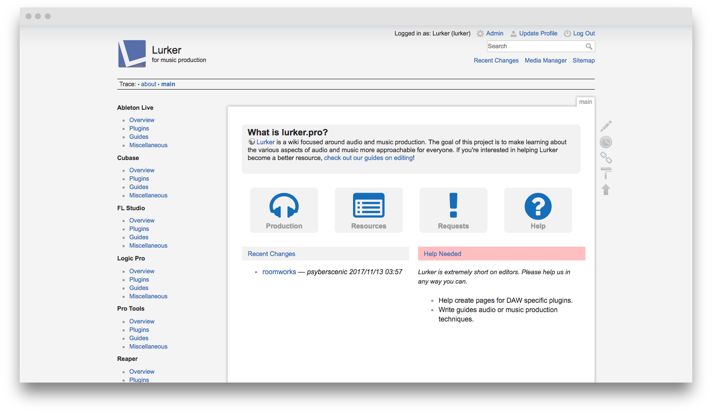
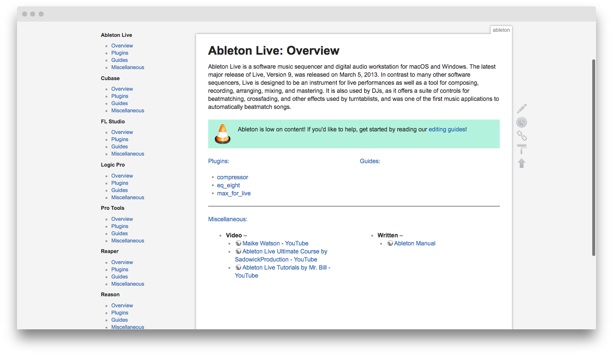
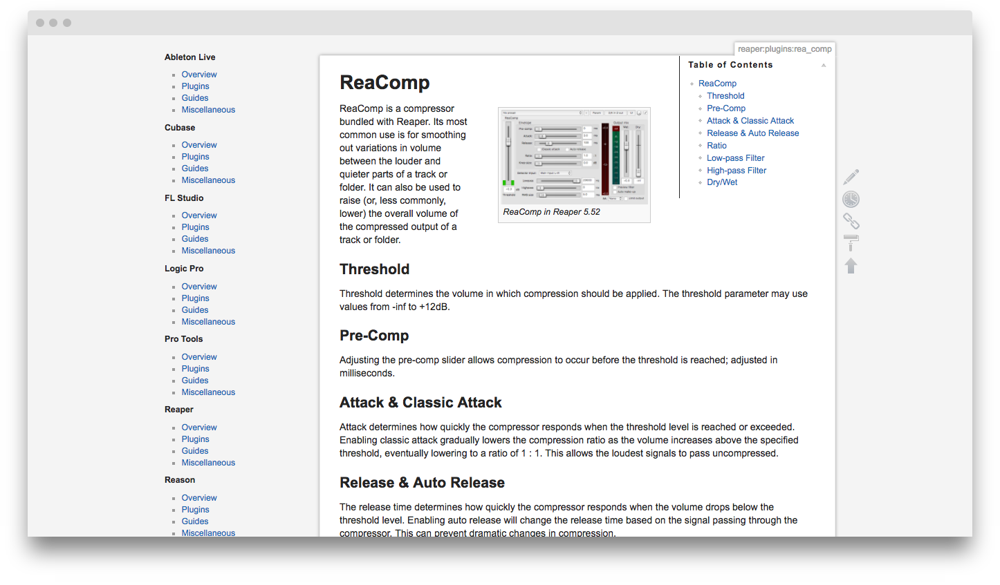
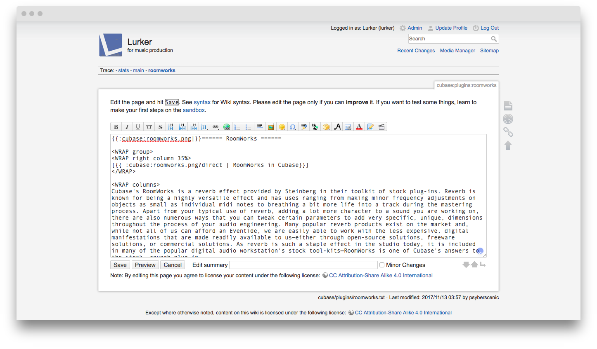
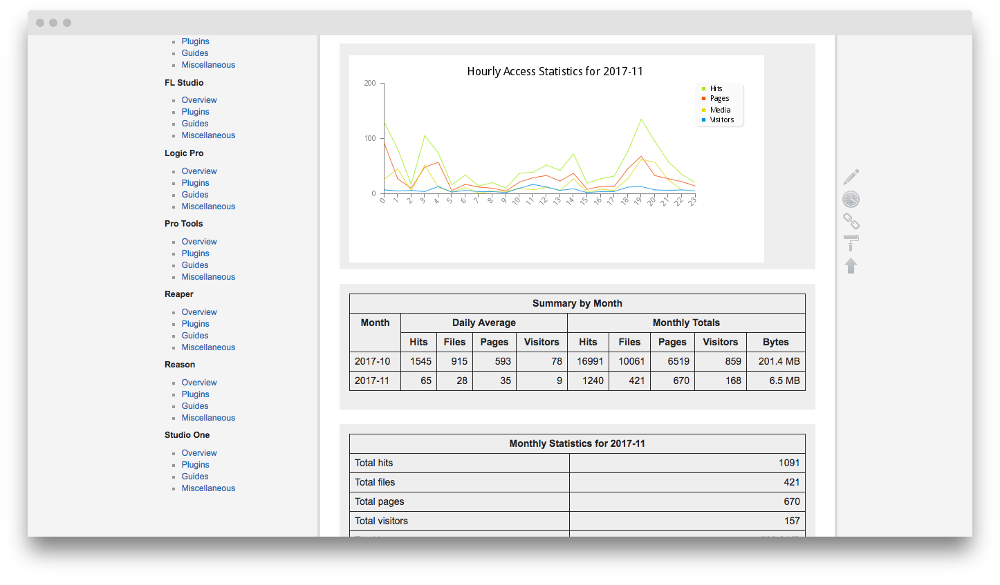
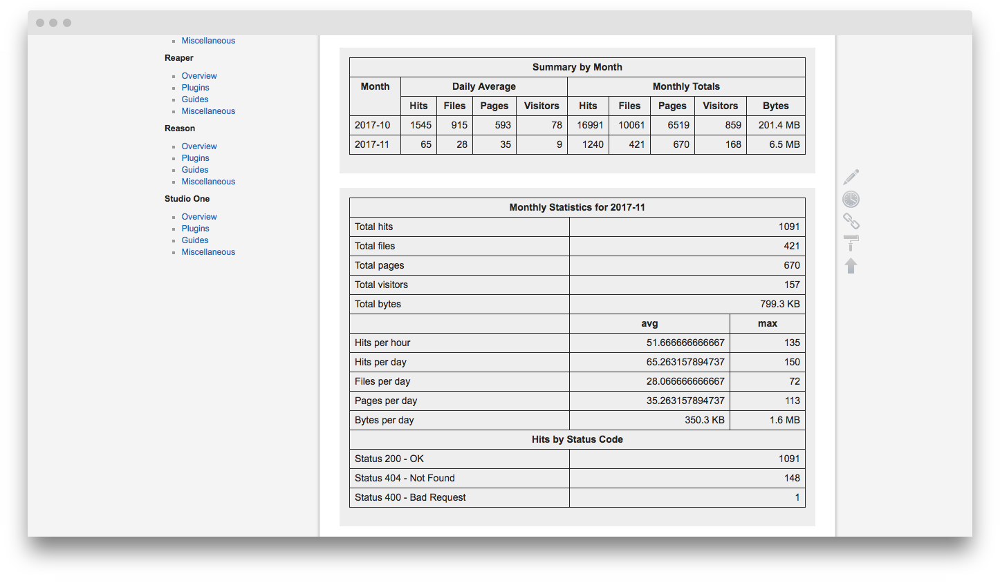
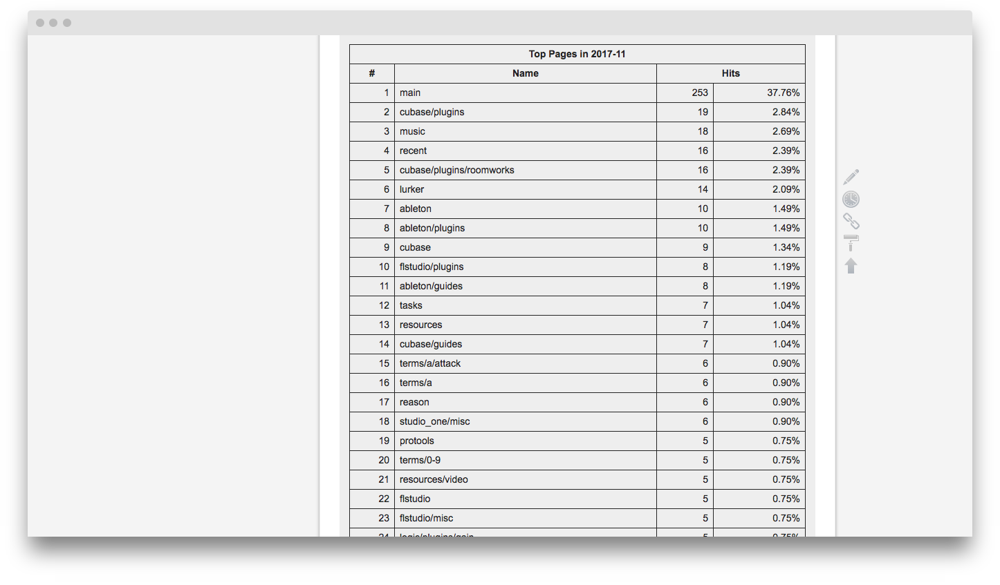

# Info

Unfortunately, I no longer have the time to maintain this project. Because of that, I've made it open source so that someone can continue to build it and create a better Lurker. My only request is that you let me know if you restart this project; I'd love to see it!

# Installation

This is a fully setup DokuWiki installation with a very large amount of plugins for page listing, advanced editing, easy file upload, data backups, monitoring, page statistics, and administration (ip bans, word blocking, etc). 

I recommend downloading a fresh copy of DokuWiki from [the official website](http://dokuwiki.org/) and extracting it into the directory of your choosing (probably `/var/www`). While DokuWiki is really nice to older versions mixing with newer versions, I'd say to install **Release 2017-02-19e "Frusterick Manners"** *(the version Lurker was running on)*, and update manually after it's installed and working. Since you originally installed a new copy of DokuWiki, navigate to `http://{yoursever}.tld/install.php` and check if there are any big errors.  If no errors are present, or it doesn't give you the option to install, you should then be fine to delete `install.php` and login to your new installation of Lurker. 

The admin account information is: 

Username: Lurker  
Password: admin

You can change this information by clicking on `Update Profile` at the top-right.

If for some reason this information does not work, edit `install-dir/conf/users.auth.php`, replacing the old password hash with this one: `$1$4fd0ad31$.cId7p1uxI4a.RcrH81On0`

This will change the password to `admin`, but rehashed *(which shouldn't matter... but hey a fix is a fix)*.

The file will look something like this:  
`lurker:PUT-NEW-HASH-HERE:Lurker:email@localhost:admin,user,editor,moderator`

Remember, everything is colon separated so make sure to leave them intact!

That should change the password to "admin", allowing you to login. Once logged in, I recommend taking a look at the admin page and getting familiar with what's installed. If you're unfamiliar with DokuWiki, definitely take a look at [their documentation](https://www.dokuwiki.org/manual).

## Other Info

While I'm pretty sure I cleared out all of my personal installation's information, I'd really appreciate that if you find any of my information, you could let me know! Other than that, thanks for continuing the project!

# Screenshots

Here are a few screenshots of the final design. The design can be edited very easily from: `main?do=admin&page=advanced_config&type=userstyle`.

